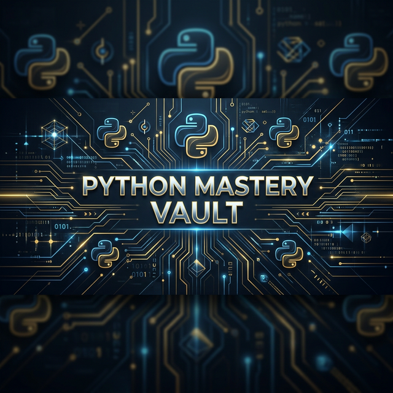

# 🐍 Python Mastery Vault

<div align="center">
  
</div>

<div align="center">
  
</div>

<div align="center">
  
  
  
  
</div>

---

## 📂 Vault Structure

> Navigate the vault's sectors ⬇️

| 🗂️ Folder | 🏷️ Description |
| :--- | :--- |
| [🎨 Turtle Masterpieces](./Turtle_Masterpieces) | Algorithmically generated art, character drawings & animations using Python's `turtle` module. |
| [🎮 Game Zone](./Game_Zone) | Interactive games — Chess, Snake, Tic-Tac-Toe, Dragon Ball Z card game, and more! |
| [🧪 Python Essentials](./Python_Essentials) | Core Python concepts, data structures, logic puzzles, and utility scripts. |
| [📡 Network & Comms](./Network_and_Comms) | Socket programming, TLS, stop-and-wait, text-to-speech, and communication protocols. |
| [🤖 Data & AI Lab](./Data_and_AI_Lab) | Machine Learning, fraud detection, OpenCV eye-tracking, and intelligent data analysis. |

---

## 🚀 Getting Started

```bash
# 1. Clone the vault
git clone https://github.com/widgetwalker/-Python-Mastery-Vault.git

# 2. Navigate to any category
cd Python-Master-Vault/Turtle_Masterpieces

# 3. Run any script
python "cute spidey.py"
```

---

## 🛠️ Tech Stack

<div align="center">
  
</div>

| Library | Purpose |
| :--- | :--- |
| `turtle` | Graphical drawings & animations |
| `mysql-connector-python` | Database-backed games |
| `opencv-python` | AI vision & eye-tracking |
| `numpy`, `pandas` | Data analysis & processing |
| `scikit-learn` | Machine learning models |

---

<p align="center">
  💡 Built & maintained with ❤️ by <a href="https://github.com/widgetwalker">WidgetWalker</a>
</p>